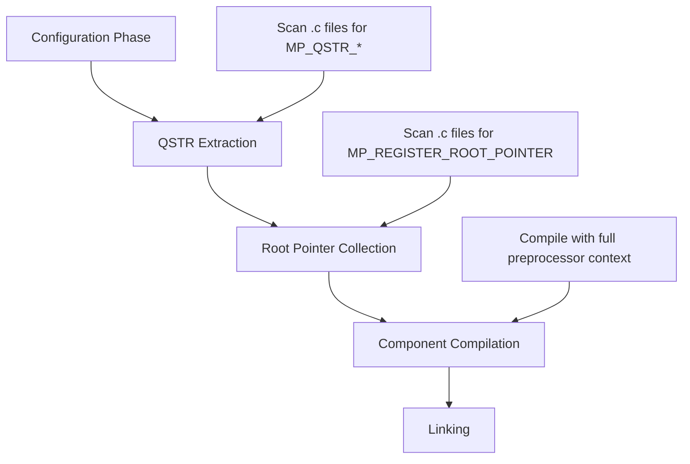

<!--
Copyright (c) 2023-2026 SG Wireless - All Rights Reserved

Permission is hereby granted, free of charge, to any person obtaining a copy
of this software and associated documentation files(the "Software"), to deal
in the Software without restriction, including without limitation the rights
to use,  copy,  modify,  merge, publish, distribute, sublicense, and/or sell
copies  of  the  Software,  and  to  permit  persons to whom the Software is
furnished to do so, subject to the following conditions:

The above copyright notice and this permission notice shall be included in
all copies or substantial portions of the Software.

THE SOFTWARE IS PROVIDED "AS IS",  WITHOUT WARRANTY OF ANY KIND,  EXPRESS OR
IMPLIED,  INCLUDING BUT NOT LIMITED TO  THE  WARRANTIES  OF  MERCHANTABILITY
FITNESS FOR A PARTICULAR PURPOSE AND NONINFRINGEMENT.  IN NO EVENT SHALL THE
AUTHORS  OR  COPYRIGHT  HOLDERS  BE  LIABLE FOR ANY CLAIM,  DAMAGES OR OTHER
LIABILITY, WHETHER IN AN ACTION OF CONTRACT, TORT OR OTHERWISE, ARISING FROM,
OUT OF OR IN  CONNECTION WITH  THE SOFTWARE OR  THE USE OR OTHER DEALINGS IN
THE SOFTWARE.

Author:     Christian Ehlers (SG Wireless)
Maintainer: Christian Ehlers (SG Wireless)

Description: Comprehensive build system documentation for sg-sdk
-->

# SG-SDK Build System Documentation

## Overview

The SG-SDK uses a multi-layer build system that integrates ESP-IDF, MicroPython, and custom SDK components. This document explains how to register and configure components within this system.

## Architecture

```
sg-sdk/
├── src/
│   ├── comps/           # SDK-wide components
│   ├── libs/            # SDK libraries
│   └── platforms/       # Platform-specific code
│       └── F1/
│           ├── comps/   # F1 platform components
│           ├── configs/ # Platform configurations
│           └── CMakeLists.txt
├── ext/                 # External dependencies
│   ├── esp-idf/
│   └── micropython/
└── tools/builder/       # Build system tools
```

## MicroPython Build System Architecture

MicroPython integration in sg-sdk uses a **multi-phase build process** that requires careful consideration of conditional compilation:

### Build Phases



### Phase Dependencies

| Phase | Preprocessor Context | Critical Requirements |
|-------|---------------------|----------------------|
| **QSTR Extraction** | Limited ESP-IDF context | Feature flags must be consistently defined |
| **Root Pointer Collection** | Limited ESP-IDF context | `MP_REGISTER_ROOT_POINTER` calls must be visible |
| **Component Compilation** | Full ESP-IDF context | All dependencies available |

### Key Insight: Preprocessing Consistency

**Problem**: ESP-IDF feature detection macros (e.g., `SOC_USB_OTG_SUPPORTED`) may not be available during extraction phases, causing features to be:
- ❌ **Disabled** during QSTR/root pointer extraction  
- ✅ **Enabled** during final compilation

**Result**: Missing struct members (`mp_state_vm_t`) and undefined symbols.

**Solution**: Use simple, consistent feature flags in `mpconfigport.h`:
```c
// ❌ Problematic - depends on ESP-IDF detection
#define MICROPY_HW_ENABLE_USBDEV (SOC_USB_OTG_SUPPORTED)

// ✅ Reliable - explicit control
#define MICROPY_HW_ENABLE_USBDEV (1)
```

## Component Registration Process

### 1. Component Types

The SDK supports several component types:

#### A. Platform Components (`src/platforms/F1/comps/`)
- Hardware interface components (GPIO, I2C, SPI, etc.)
- Platform-specific functionality
- Examples: `rgbled-if`, `fuel-gauge-if`, `lora-if`

#### B. SDK Components (`src/comps/`)
- Cross-platform functionality
- High-level application components
- Examples: `ctrl-client`, `lora`, `fw-version`

#### C. SDK Libraries (`src/libs/`)
- Utility libraries
- Shared functionality
- Examples: `adt`, `logs`, `mpy-al`, `state-machine`

### 2. Component Registration Steps

To add a new component (using RGB LED as example):

#### Step 1: Create Component Directory Structure
```
src/platforms/F1/comps/rgbled-if/
├── CMakeLists.txt       # Component build configuration
├── rgbled.c             # Implementation
├── rgbled.h             # Public interface
├── mod_rgbled.c         # MicroPython module
├── rgbled.config        # Kconfig menu options
└── defaults.config      # Default configuration
```

#### Step 2: Component CMakeLists.txt
```cmake
# Basic component registration
__sdk_add_component( f1_rgbled_if
    LOGS_DEFS
        ${CMAKE_CURRENT_LIST_DIR}/rgbled.c

    MPY_MODS
        ${CMAKE_CURRENT_LIST_DIR}/mod_rgbled.c

    SRCS
        "${CMAKE_CURRENT_LIST_DIR}/*.c"

    INCS_IF
        ${CMAKE_CURRENT_LIST_DIR}

    REQUIRED_ESP_LIBS
        esp_hw_support
        esp_driver_gpio

    MENU_CONFIG     ${CMAKE_CURRENT_LIST_DIR}/rgbled.config
    MENU_PROMPT     "RGB LED interface component"
    MENU_GROUP      MAIN.PLATFORM.F1.RGBLED
)

# Register default configuration
__sdk_add_kconfig_default(${CMAKE_CURRENT_LIST_DIR}/defaults.config)
```

#### Step 3: Platform Registration (`src/platforms/F1/CMakeLists.txt`)
Add a conditional `__sdk_add_comp_dirs()` block (do **not** use `__sdk_add_platform_component()` — that function does not exist):
```cmake
if( __feature_rgb_led )
    __sdk_add_comp_dirs( ${__dir_platform_comps}/rgbled-if )
endif()
```

Note: Feature names with hyphens in `.toml` (e.g., `rgb-led`) become underscores in CMake
(`__feature_rgb_led`). This conversion is done automatically by `build_handler.py`.

#### Step 4: Board Feature Declaration (`src/platforms/F1/boards/SGW3501-F1-StarterKit.toml`)
```toml
[features]
    rgb-led = true
```

Hyphens in feature names are allowed and are automatically converted to underscores for
the CMake `__feature_*` variable.

#### Step 5: SDK Configuration (`src/platforms/F1/configs/sdkconfig.base`)
```
CONFIG_FEATURE_RGB_LED=y
```

### 3. Build System Macros

#### `__sdk_add_component()`
Main component registration macro with these parameters:

- **LOGS_DEFS**: Files for logging system registration
- **MPY_MODS**: MicroPython module files (scanned by the mp-lite-if binding generator)
- **SRCS**: Source files glob pattern (supports both `.c` and `.cpp`)
- **INCS_IF**: Include directories (interface — exposed to consumers)
- **INCS_PRIV**: Private include directories (only for this component's sources)
- **REQUIRED_ESP_LIBS**: ESP-IDF built-in components **and** managed components from the component registry
- **REQUIRED_SDK_LIBS**: Internal SDK components (e.g., `log_lib`, `f1_logs_if`, `adt_lib`)
- **FLAGS**: Per-component compiler flags (e.g., `-std=gnu++17` for C++17 sources)
- **MENU_CONFIG**: Kconfig menu file
- **MENU_PROMPT**: Menu display name
- **MENU_GROUP**: Menu category

**Important distinction — `REQUIRED_ESP_LIBS` vs `REQUIRED_SDK_LIBS`:**
- `REQUIRED_ESP_LIBS`: Use for ESP-IDF built-in libs (e.g., `esp_driver_gpio`) **and** managed
  components from the ESP component registry (e.g., `espressif__esp-dl`, `espressif__esp_modem`)
- `REQUIRED_SDK_LIBS`: Use only for SDK-internal components defined by `__sdk_add_component()`

#### `__sdk_add_comp_dirs()`
Registers a directory containing a `CMakeLists.txt` as a component directory.
Use this inside conditional `if(__feature_xyz)` blocks in `src/platforms/F1/CMakeLists.txt`.
**Note**: `__sdk_add_platform_component()` does not exist — always use `__sdk_add_comp_dirs()`.

#### `__sdk_add_kconfig_default()`
Register default Kconfig values from file

#### `__sdk_menu_config_group_add()`
Create menu configuration group

### 4. Managed Components (ESP Component Registry)

Components from [components.espressif.com](https://components.espressif.com) require two
additional integration points beyond a regular component.

#### A. Declare download requirement in `build_handler.py`

In `src/platforms/F1/build_handler.py`, find the `platform_required_components = {}` block
and add an entry for your feature:

```python
platform_required_components = {}
if features.get('lte', False):
    platform_required_components['espressif__esp_modem'] = '^2.0.0'
if features.get('espdl', False):
    platform_required_components['espressif__esp-dl'] = '^3.3.2'
```

- The dict key is the **directory name** the component lands in under `managed_components/`
- Naming: `namespace/component-name` on the registry becomes `namespace__component-name`
  as the directory (slash → double-underscore, hyphens are **preserved**)
- Version: use `^X.Y.Z` (caret range) or `>=X.Y.Z` (minimum)
- The download is handled automatically; components land in
  `src/platforms/F1/managed_components/`

#### B. Reference managed component headers and link target

In the component's `CMakeLists.txt`:

```cmake
INCS_PRIV
    ${__dir_platform}/managed_components/espressif__esp-dl/esp-dl/dl/model/include
    # add other subdirs from the managed component as needed

REQUIRED_ESP_LIBS
    espressif__esp-dl    # links the managed component; use the directory name
```

#### Working examples
- `espressif__esp_modem`: see `src/platforms/F1/comps/lte/CMakeLists.txt`
- `espressif__esp-tflite-micro`: see branch `1.4.1-rc5-tflite-01`

### 6. Configuration System

#### A. Kconfig Integration
Each component can provide:
- `*.config` files with menu options
- `defaults.config` with default values

#### B. Feature Flags
Components are conditionally compiled based on:
- Board configuration (`.toml` files)
- SDK configuration (`sdkconfig.*` files)
- CMake feature variables (`__feature_*`)

### 6. MicroPython Integration (mp-lite-if)

This SDK uses the **mp-lite-if** macro system (not raw MicroPython API) for all modules.

#### Module Registration in CMakeLists.txt
```cmake
MPY_MODS
    ${CMAKE_CURRENT_LIST_DIR}/mod_mycomp.c
```

#### Module Implementation (`mod_mycomp.c`)

```c
#define __log_subsystem   F1
#define __log_component   mycomp
#include "log_lib.h"
#include "mp_lite_if.h"

// Module name declaration
__mp_mod_name(mycomp, mycomp);

// Function example
__mp_mod_fun_0(mycomp, info)(void) {
    __log_info("mycomp info");
    return mp_const_none;
}
```

The **mp-lite-if binding generator** (`src/libs/mpy-al/gen/gen_mp_cmods.py`) scans `.c`
files listed in `MPY_MODS` and auto-generates `__mp_mod_{name}.c` in `mpy_cmod_gen_dir/`.
That generated file handles all `MP_REGISTER_MODULE` / dict table boilerplate.

**Critical rules for mp-lite-if:**
- `__mp_mod_*` macros must only appear in **`.c` files** — the generator does not scan `.cpp`
- For C++ components: keep the `mod_*.c` file as pure C; expose C++ internals via `extern "C"`
- No manual `#include __mp_mod_binding_file()` needed — the generator handles it

## Common Registration Locations

When adding/modifying components, you typically need to update:

### Required Files (Core Registration)
1. **Component CMakeLists.txt** - `src/platforms/F1/comps/COMPNAME/CMakeLists.txt`
2. **Platform CMakeLists.txt** - `src/platforms/F1/CMakeLists.txt` (add `if(__feature_X) __sdk_add_comp_dirs()`)
3. **Board config .toml** - `src/platforms/F1/boards/BOARDNAME.toml` (add feature under `[features]`)

### Additional for Managed Components (ESP registry)
4. **build_handler.py** - `src/platforms/F1/build_handler.py` (add to `platform_required_components`)

### Optional Files (Feature-Dependent)
5. **sdkconfig.base** - Base configuration flags
6. **defaults.config** - Component defaults
7. ***.config** - Menu configuration options

## Build Flow

```
1. build_handler.py reads board .toml → features dict
2. Features passed to CMake as -D__feature_FEAT:BOOL=ON/OFF (hyphens→underscores)
3. build_handler.py downloads any required managed components to managed_components/
4. Platform CMakeLists.txt uses if(__feature_X) to register component dirs
5. Component CMakeLists.txt files are processed by __sdk_add_component()
6. mp-lite-if generator scans MPY_MODS .c files → generates binding files
7. ESP-IDF idf_component_register() generated with all SRCS, INCLUDE_DIRS, REQUIRES
8. Final firmware linked
```

## Troubleshooting

### Common Issues


#### "Component not found"
- Check platform registration in `src/platforms/F1/CMakeLists.txt`
- Verify feature flag in board configuration
- Ensure component directory exists

#### "Dependency not satisfied"
- Check `REQUIRED_ESP_LIBS` in component CMakeLists.txt
- Verify ESP-IDF component is available in version 5.4
- Check SDK library dependencies

#### "Symbol not defined"
- Verify include paths (`INCS_IF`)
- Check header file exports
- Ensure component is actually compiled (check feature flags)

#### "MicroPython module not available"
- Check `MPY_MODS` registration
- Verify `MP_REGISTER_MODULE` call
- Ensure module condition macro is defined

#### "MicroPython compilation errors with missing struct members" ⚠️ CRITICAL
**Symptom**: Errors like `'mp_state_vm_t' has no member named 'usbd'` during compilation

**Root Cause**: MicroPython's multi-phase build system has inconsistent preprocessing conditions between:
1. **QSTR extraction phase** - Scans source files to generate string constants
2. **Root pointer collection phase** - Scans for `MP_REGISTER_ROOT_POINTER` calls  
3. **Final compilation phase** - Compiles actual object files

**Common Scenario**: USB device support enabled during final compilation but disabled during extraction phases due to conditional compilation dependencies (e.g., `SOC_USB_OTG_SUPPORTED`).

**Investigation Process**:
```bash
# Check if root pointers are generated
cat build/.../genhdr/root_pointers.h | grep usbd

# Check if QSTRs are generated  
grep -i usb build/.../genhdr/qstrdefs.generated.h

# Force header regeneration for testing
rm -rf build/.../genhdr/
./fw_builder.sh --board SGW3501-F1-StarterKit build
```

**Resolution Strategies**:
1. **Force-enable critical features** in `mpconfigport.h`:
   ```c
   // Force USB device support during all build phases
   #define MICROPY_HW_ENABLE_USBDEV (1)
   ```
   
2. **Avoid complex conditional dependencies** that may differ between build phases

3. **Verify consistency** across build phases by checking generated files

**Technical Details**: 
- MicroPython uses `make` to run extraction phases with different preprocessor contexts
- Complex ESP-IDF feature detection (`SOC_*` macros) may not be available during extraction
- `MP_REGISTER_ROOT_POINTER` and QSTR usage must be visible in ALL build phases
- Missing root pointers cause struct compilation errors; missing QSTRs cause linking errors

**Prevention**: When adding MicroPython features that use `MP_REGISTER_ROOT_POINTER`:
- Test with clean builds (`rm -rf build/`)
- Verify generated files contain expected entries
- Use simple, consistent feature enabling conditions

### Debug Commands

```bash
# Check component registration
grep -r "rgbled-if" src/platforms/F1/

# Check feature configuration
grep -r "__feature_rgb_led" src/platforms/F1/

# Check build dependencies
./fw_builder.sh --board SGW3501-F1-StarterKit build --verbose

# Debug MicroPython build phases (USB device example)
rm -rf build/.../genhdr/  # Force regeneration
./fw_builder.sh --board SGW3501-F1-StarterKit build
echo "=== Root Pointers ==="
cat build/.../genhdr/root_pointers.h
echo "=== USB QSTRs ==="
grep -i usb build/.../genhdr/qstrdefs.generated.h
```

## Best Practices

### 1. Naming Conventions
- Component names: `kebab-case` (e.g., `rgbled-if`)
- CMake components: `snake_case` (e.g., `f1_rgbled_if`)  
- Feature variables: `__feature_snake_case` (e.g., `__feature_rgb_led`)

### 2. Directory Structure
- Keep related files together in component directory
- Use clear, descriptive filenames
- Separate interface headers from implementation

### 3. Dependencies
- Minimize ESP-IDF dependencies where possible
- Use SDK libraries for common functionality
- Document external dependencies clearly

### 4. Configuration
- Provide sensible defaults
- Use feature flags for optional functionality
- Keep board-specific configuration minimal

## Example: RGB LED Component Integration

This is the complete registration process used for the RGB LED component modernization:

### Files Modified
- `src/platforms/F1/comps/rgbled-if/CMakeLists.txt` - Updated dependencies
- `src/platforms/F1/comps/rgbled-if/rgbled.c` - Implementation changes  
- Component already registered in platform, no additional registration needed

### Key Learnings
- Existing components require minimal registration changes
- Dependency updates in component CMakeLists.txt are often sufficient
- Platform and board configuration usually remain unchanged
- Focus changes on implementation rather than registration

## Example: I2C Bridge Architecture Integration

This demonstrates the implementation of a modern I2C bridge component for MicroPython integration:

### Component Structure
```
src/comps/mp_i2c_bridge/
├── CMakeLists.txt           # Component registration
├── mp_i2c_bridge.h          # Bridge interface  
├── mp_i2c_bridge.c          # Bridge implementation
└── README.md                # Component documentation
```

### Bridge Component Registration
```cmake
# src/comps/mp_i2c_bridge/CMakeLists.txt
__sdk_add_component(mp_i2c_bridge
    SRCS
        "${CMAKE_CURRENT_LIST_DIR}/mp_i2c_bridge.c"
    
    INCS_IF  
        "${CMAKE_CURRENT_LIST_DIR}"
    
    MPY_MODS
        "${CMAKE_CURRENT_LIST_DIR}/mp_i2c_bridge.c"
        
    LOGS_DEFS
        "${CMAKE_CURRENT_LIST_DIR}/mp_i2c_bridge.c"
)
```

### Consumer Component Updates

Components using the I2C bridge must add bridge dependency:

```cmake
# src/platforms/F1/comps/fuel-gauge-if/CMakeLists.txt
__sdk_add_component( fuel_gauge_if
    SRCS
        "${CMAKE_CURRENT_LIST_DIR}/src/fuel_gauge_mp.c"  # Updated source
    
    INCS_IF
        "${CMAKE_CURRENT_LIST_DIR}/inc"
    
    REQUIRED_SDK_LIBS
        mp_i2c_bridge  # Bridge dependency
        
    MPY_MODS
        "${CMAKE_CURRENT_LIST_DIR}/src/fuel_gauge_mp.c"
        
    LOGS_DEFS
        "${CMAKE_CURRENT_LIST_DIR}/src/fuel_gauge_mp.c"
)
```

### Bridge Integration Pattern

1. **Create Bridge Component**: New SDK component providing C interface to MicroPython I2C
2. **Update Consumer Dependencies**: Add `mp_i2c_bridge` to `REQUIRED_SDK_LIBS`
3. **Implement MicroPython Variants**: Create `*_mp.c` files using bridge API
4. **Switch Source Files**: Update CMakeLists.txt to use MicroPython variants
5. **Maintain Interface Compatibility**: Keep existing header interfaces unchanged

### Key Benefits
- **Unified I2C Management**: Prevents driver conflicts via single MicroPython I2C instance
- **ESP-IDF v5.4+ Compatibility**: Uses modern MicroPython I2C implementation
- **Clean Architecture**: Separates hardware drivers from I2C transport
- **Maintainable Dependencies**: Clear component relationships via CMakeLists.txt

### Files Modified
- `src/comps/mp_i2c_bridge/` - New bridge component (complete)
- `src/platforms/F1/comps/fuel-gauge-if/CMakeLists.txt` - Added bridge dependency
- `src/platforms/F1/comps/ioexp-if/CMakeLists.txt` - Added bridge dependency  
- `src/platforms/F1/comps/fuel-gauge-if/src/fuel_gauge_mp.c` - Bridge integration
- `src/platforms/F1/comps/ioexp-if/src/ioexp_mp.c` - Bridge integration

### Implementation Results
- ✅ **Build Success**: SGW3501-F1-StarterKit firmware builds cleanly
- ✅ **Flash Success**: Firmware deploys successfully to hardware
- ✅ **Interface Compatibility**: All existing function signatures preserved
- ✅ **Future-Proof**: Automatic ESP-IDF driver updates via MicroPython

## Future Considerations

### Potential Improvements
1. **Automated Component Scaffolding** - Scripts to generate component templates
2. **Dependency Visualization** - Tools to map component relationships  
3. **Build Cache Optimization** - Improve incremental build performance
4. **Component Testing Framework** - Standardized testing for components

### Documentation Updates
- Keep this document updated when build system changes
- Add component-specific documentation in component directories
- Document any platform-specific build requirements

## Case Study: USB Runtime Device Restoration

### Background
During MicroPython v1.26.1 upgrade, USB Runtime Device (`machine.USBDevice`) was disabled due to compilation errors. Investigation revealed critical insights about MicroPython's build system.

### Problem Analysis
**Error**: `'mp_state_vm_t' has no member named 'usbd'`

**Root Cause**: Inconsistent preprocessing between build phases:
1. ✅ USB device code compiled during final phase (SOC_USB_OTG_SUPPORTED = 1)
2. ❌ USB device code excluded during QSTR/root pointer extraction (limited preprocessor context)
3. ❌ `MP_REGISTER_ROOT_POINTER(usbd)` not processed → missing struct member

### Investigation Process

**Step 1: Verify Generated Files**
```bash
# Check if root pointer was collected
cat build/.../genhdr/root_pointers.h | grep usbd
# Result: Missing - explains struct compilation error

# Check if QSTRs were generated
grep -i usb build/.../genhdr/qstrdefs.generated.h  
# Result: Missing - confirms extraction phase exclusion
```

**Step 2: Test Manual Fix**
```bash
# Manually add missing root pointer
echo "mp_obj_t usbd;" >> build/.../genhdr/root_pointers.h
./fw_builder.sh --board SGW3501-F1-StarterKit build
# Result: Build succeeds - confirms root cause
```

**Step 3: Implement Systematic Fix**
```c
// In mpconfigport.h - force consistent enabling
#define MICROPY_HW_ENABLE_USBDEV (1)  // Was: (SOC_USB_OTG_SUPPORTED)
```

### Resolution Results
- ✅ Clean build succeeds completely
- ✅ Root pointer generated: `mp_obj_t usbd;` in root_pointers.h
- ✅ QSTRs generated: MP_QSTR_USBDevice, MP_QSTR_desc_dev, etc.
- ✅ Runtime testing: `machine.USBDevice()` works correctly

### Key Learnings

**Build System Insights:**
1. **Multi-phase consistency is critical** - Features must be enabled consistently across all build phases
2. **ESP-IDF feature detection can be problematic** - Complex macros may not be available during extraction
3. **Generated files are diagnostic tools** - Check root_pointers.h and qstrdefs.generated.h to debug issues
4. **Force-enabling is sometimes necessary** - Explicit control beats complex conditional logic

**MicroPython Integration Guidelines:**
1. **Use simple feature flags** in mpconfigport.h for critical features
2. **Test with clean builds** when debugging extraction issues  
3. **Verify generated files** after configuration changes
4. **Document preprocessing dependencies** for complex features

**Debugging Methodology:**
1. Reproduce error with clean build
2. Check generated files for missing entries
3. Test manual fixes to confirm root cause
4. Implement systematic solution
5. Validate with hardware testing

### Broader Implications

This case study demonstrates that:
- **Complex build systems** require understanding of all phases
- **Conditional compilation** can have subtle, phase-dependent effects  
- **Generated file analysis** is essential for diagnosing build issues
- **Systematic validation** (build + runtime testing) ensures complete resolution

### Recommended Practices

For future MicroPython feature integrations:
1. **Start with simple enabling conditions** - avoid complex ESP-IDF dependencies in mpconfigport.h
2. **Test extraction phases explicitly** - verify root pointers and QSTRs are generated  
3. **Use automated testing** - implement REPL tests for runtime validation
4. **Document preprocessing requirements** - note any phase-dependent behaviors

## Case Study: Virtual Timer Runtime Bug Fix

### Background
During MicroPython v1.26.1 upgrade, virtual timers were restored but had a critical runtime bug where timers created with constructor arguments never fired.

### Problem Analysis
**Error**: Virtual timers created with `Timer(-1, callback=..., period=500)` were not executing callbacks

**Root Cause**: The timer creation flow had incomplete implementation:
1. ✅ `hook_mpy_machine_timer_virtual_new()` created timer object
2. ✅ `virtual_timer_init_helper()` called `xTimerCreate()` to create FreeRTOS timer
3. ❌ **Missing `xTimerStart()` call** - timer created but never started
4. ✅ Only the `.init()` method path called `xTimerStart()`

**Impact**: 
- Constructor syntax `Timer(-1, callback=..., period=500)` created non-functional timers
- Manual `.init()` call required: `t = Timer(-1); t.init(callback=..., period=500)` worked
- CTRL client connection handlers failed - MQTT check_msg never executed

### Investigation Process

**Step 1: Verify Timer Creation**
```bash
# Check if timer object is created
grep -A20 "hook_mpy_machine_timer_virtual_new" src/platforms/F1/mpy-hooks/machine_timers_hooks.c
# Result: Timer object created successfully
```

**Step 2: Check FreeRTOS Timer Lifecycle**
```bash
# Search for xTimerStart calls
grep "xTimerStart" src/platforms/F1/mpy-hooks/machine_timers_hooks.c
# Result: Only found in hook_mpy_machine_timer_virtual_init(), not in init_helper
```

**Step 3: Compare with Hardware Timers**
Hardware timers (Timer(0-3)) worked immediately because ESP32 hardware timers auto-start.
Virtual timers using FreeRTOS require explicit `xTimerStart()` call.

### Resolution Implementation

**File Modified**: `src/platforms/F1/mpy-hooks/machine_timers_hooks.c`

**Changes Made**:
```c
// In virtual_timer_init_helper() after xTimerCreate()
else
{
    __log_info("create OS timer ->[self: %08x] %s", self, name);
    self->handle = xTimerCreate(
        "virtual-timer", self->period / portTICK_PERIOD_MS,
        self->repeat, self, (void*)virtual_timer_generic_callback);
    
    if(self->handle == NULL)
    {
        __log_error("failed to create timer: %s", name);
        goto clean_and_exit;
    }
}

// Start the timer immediately
if( xTimerStart(self->handle, 0) != pdPASS )
{
    __log_error("failed to start timer: %s", name);
    goto clean_and_exit;
}
else
{
    self->enabled = true;
}

virtual_timer_add(self);
return;
```

### Resolution Results
- ✅ Clean build succeeds completely
- ✅ Virtual timers fire correctly with constructor syntax
- ✅ CTRL client connection handlers work: `Timer(-1, callback=check_msg, period=500)`
- ✅ Both constructor and `.init()` method paths functional
- ✅ Hardware testing: MQTT connection monitoring operational

### Key Learnings

**FreeRTOS Timer Lifecycle:**
1. **Creation phase**: `xTimerCreate()` allocates timer but leaves it dormant
2. **Activation phase**: `xTimerStart()` required to actually start timer execution
3. **State tracking**: Must set `self->enabled = true` after successful start

**MicroPython Integration Patterns:**
- Constructor with arguments should create **ready-to-use** objects
- Separate `.init()` method is for reconfiguration, not initial activation
- Both paths must result in identical operational state

**Debugging Methodology:**
1. Test with user-reported failing code pattern
2. Add debug prints to trace execution flow
3. Compare working vs non-working code paths
4. Check FreeRTOS API documentation for lifecycle requirements
5. Implement fix and validate both usage patterns

### Broader Implications

This case study demonstrates that:
- **Platform abstraction requires complete lifecycle management** - creating objects isn't enough
- **Constructor convenience matters** - users expect `Timer(-1, ...)` to work immediately
- **Cross-platform patterns must be honored** - hardware timers work immediately, so should virtual
- **Testing both APIs is essential** - constructor and `.init()` must both work correctly

---

*This documentation reflects the build system as of MicroPython v1.26.1 upgrade (October 2025)*

<!--- end of file --->