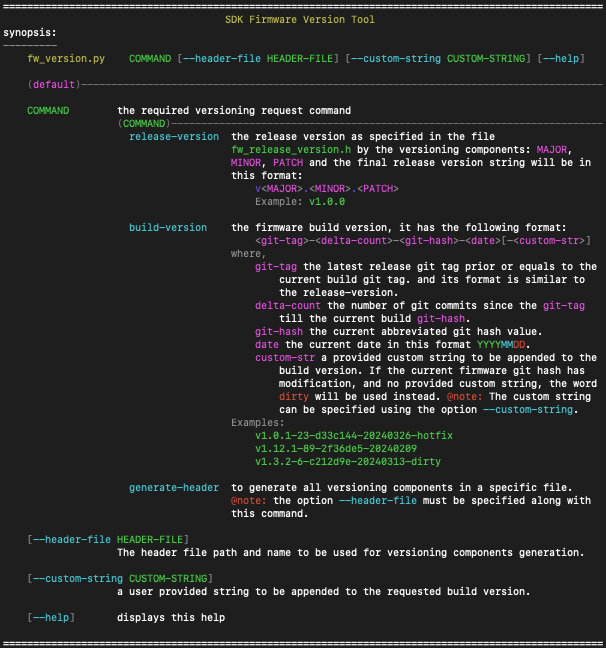

<!------------------------------------------------------------------------------
 ! @copyright Copyright (c) 2023-2024 SG Wireless - All Rights Reserved
 !
 ! Permission is hereby granted, free of charge, to any person obtaining a copy
 ! of this software and associated documentation files(the “Software”), to deal
 ! in the Software without restriction, including without limitation the rights
 ! to use,  copy,  modify,  merge, publish, distribute, sublicense, and/or sell
 ! copies  of  the  Software,  and  to  permit  persons to whom the Software is
 ! furnished to do so, subject to the following conditions:
 !
 ! The above copyright notice and this permission notice shall be included in
 ! all copies or substantial portions of the Software.
 !
 ! THE SOFTWARE IS PROVIDED “AS IS”,  WITHOUT WARRANTY OF ANY KIND,  EXPRESS OR
 ! IMPLIED,  INCLUDING BUT NOT LIMITED TO  THE  WARRANTIES  OF  MERCHANTABILITY
 ! FITNESS FOR A PARTICULAR PURPOSE AND NONINFRINGEMENT.  IN NO EVENT SHALL THE
 ! AUTHORS  OR  COPYRIGHT  HOLDERS  BE  LIABLE FOR ANY CLAIM,  DAMAGES OR OTHER
 ! LIABILITY, WHETHER IN AN ACTION OF CONTRACT, TORT OR OTHERWISE, ARISING FROM,
 ! OUT OF OR IN  CONNECTION WITH  THE SOFTWARE OR  THE USE OR OTHER DEALINGS IN
 ! THE SOFTWARE.
 !
 ! @author  Ahmed Sabry (SG Wireless)
 !
 ! @brief   Firmware Versioning Explaination
 !----------------------------------------------------------------------------->

# Firmware Versioning
<!------------------------------------------------------------------------------
 ! TOC
 !----------------------------------------------------------------------------->

## Contents

* [Introduction](#intro)
* [Version Types](#ver-types)
    * [Release Versioning](#rel-ver)
    * [Build Versioning](#build-ver)
* [Version Header](#ver-header)
* [Version Tool](#ver-tool)

<!------------------------------------------------------------------------------
 ! Introduction
 !----------------------------------------------------------------------------->
<div id="intro"></div>

## Introduction

Firmware versioning has two main types `release versioning` and
`build versioning`. With each release a release version will be updated manually
in the file `<SDK-ROOT>/src/comps/fw-version/fw_version.h` and a git tag will be
created with the release version. Each firmware build will have a build version
with more customizable identities as will be explained later.

<!------------------------------------------------------------------------------
 ! Version Types
 !----------------------------------------------------------------------------->
<div id="ver-types"></div>

## Version Types

<div id="rel-ver"></div>

### Release Versioning

Release version follows the following format:

```
    v<MAJOR>.<MINOR>.<PATCH>

    Examples: v1.0.0 , v3.3.12
```
Release versioning comprises the following components:
* `<MAJOR>` with reflects incompatible changes in the APIs and new features.
* `<MINOR>` with reflects changes with backward compatibility.
* `<PATCH>` with reflects backward compatible bug fix.

<div id="build-ver"></div>

### Build Versioning

Build version follows the following format:

```
    <git-tag>-<delta-count>-<git-hash>-<date>[-<custom-str>]

    Examples:
        v1.0.1-23-d33c144-20240326-hotfix
        v1.12.1-89-2f36de5-20240209
        v1.3.2-6-c212d9e-20240313-dirty
```
Build versioning comprises the following components:
* `<git-tag>` the latest release git tag prior or equals to the current build
  git tag. and its format is same as the release-version..
* `<delta-count>` the number of git commits since the `<git-tag>` till the
  current build `<git-hash>`.
* `<git-hash>` the current abbreviated git hash value.
* `<date>` the current date in this format `YYYYMMDD`.
* `<custom-str>` a provided custom string to be appended to the build version.
  If the current firmware git hash has modification, and no provided custom
  string, the word dirty will be used instead.<br>
  The custom string can be passed to the build system `builder.py` tools using
  the option `--custom-version-string`

<!------------------------------------------------------------------------------
 ! Version Header
 !----------------------------------------------------------------------------->
<div id="ver-header"></div>

## Version Header

The file `<SDK-ROOT>/src/comps/fw-version/fw_version.h` is the main firmware
version header file that can be used anywhere in the firmware to use the
firmware versioning variables and methods.

The current firmware release version is statically and manually updated in this
file. The following variables carries the release versioning information.

|variable|description|
|:--|:----|
|FW_RELEASE_VERSION_MAJOR| firmware release major number|
|FW_RELEASE_VERSION_MINOR| firmware release minor number|
|FW_RELEASE_VERSION_PATCH| firmware release patch number|
|FW_RELEASE_VERSION_STRING| release version string in its dedicated format|

The build system generates the build versioning components and pass it to the
source code during compilation in the variable
`FW_GENERATED_BUILD_VERSION_HEADER`.<br>
This generated file defines the following variables:

|variable|description|
|:--|:----|
|FW_BUILD_VERSION_ENABLE|identifies if the build versioning components are present or not|
|FW_BUILD_VERSION_GIT_TAG|the `<git-tag>` component as a string|
|FW_BUILD_VERSION_GIT_DELTA|the `<delta-count>` component as a string|
|FW_BUILD_VERSION_GIT_HASH|the `<git-hash>` component as a string|
|FW_BUILD_VERSION_DATE|the `<date>` component as a string|
|FW_BUILD_VERSION_CUSTOM|the `<custom-str>` component as a string or `"None" value` if not present|
|FW_BUILD_VERSION_STRING|the complete build version string|

> **Remark**: the variable `FW_VERSION_STRING` selects the build version if it is
> applicable and present, otherwise it will select the release version string.
> this variable can be used eventually irrespective of the version type.

<!------------------------------------------------------------------------------
 ! Version Tool
 !----------------------------------------------------------------------------->
<div id="ver-tool"></div>

## Version Tool

A versioning tool exists to organize and help other parties such as the build
system to utilize the firmware versioning.

The version tool exists at the path
`<SDK-ROOT>/src/comps/fw-version/fw_version.py`.

Issue this command to navigate its help screen:
`<SDK-ROOT>/src/comps/fw-version/fw_version.py --help`

The displayed help screen is like this


The build system uses it to deduce the needed version string type or to generate
the intended generated build version header file.

```shell
# Examples

# get the release version
python3 src/comps/fw-version/fw_version.py release-version
# output may be:: v1.0.0

# get the build version
python3 src/comps/fw-version/fw_version.py build-version
# output may be:: v4.4.4-433-3cec3a0026-20240321

python3 src/comps/fw-version/fw_version.py build-version \
        --custom-string "lib-x fix"
# output may be:: v4.4.4-433-3cec3a0026-20240321-lib-x_fix

python3 src/comps/fw-version/fw_version.py \
        generate-header \
        --custom-string "lib-x fix" \
        --header-file path/to/generated_build_version_header.h
# output may be:: v4.4.4-433-3cec3a0026-20240321-lib-x_fix
```

<!--- end of file ------------------------------------------------------------->
