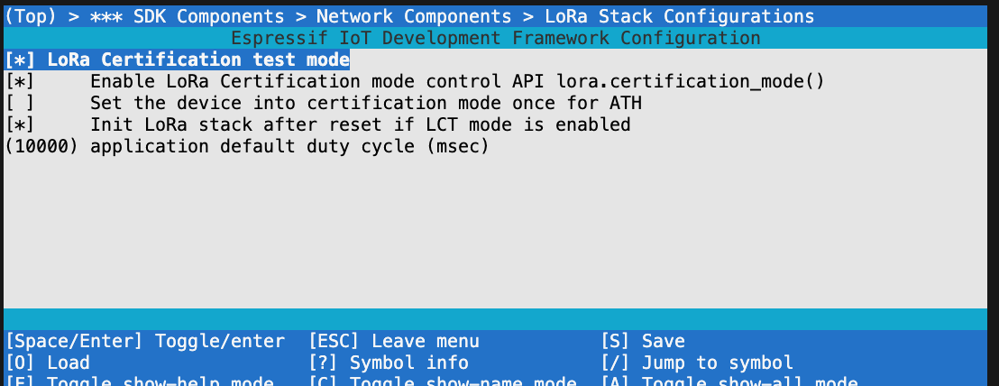

<!------------------------------------------------------------------------------
 ! @copyright Copyright (c) 2023-2024 SG Wireless - All Rights Reserved
 !
 ! Permission is hereby granted, free of charge, to any person obtaining a copy
 ! of this software and associated documentation files(the “Software”), to deal
 ! in the Software without restriction, including without limitation the rights
 ! to use,  copy,  modify,  merge, publish, distribute, sublicense, and/or sell
 ! copies  of  the  Software,  and  to  permit  persons to whom the Software is
 ! furnished to do so, subject to the following conditions:
 !
 ! The above copyright notice and this permission notice shall be included in
 ! all copies or substantial portions of the Software.
 !
 ! THE SOFTWARE IS PROVIDED “AS IS”,  WITHOUT WARRANTY OF ANY KIND,  EXPRESS OR
 ! IMPLIED,  INCLUDING BUT NOT LIMITED TO  THE  WARRANTIES  OF  MERCHANTABILITY
 ! FITNESS FOR A PARTICULAR PURPOSE AND NONINFRINGEMENT.  IN NO EVENT SHALL THE
 ! AUTHORS  OR  COPYRIGHT  HOLDERS  BE  LIABLE FOR ANY CLAIM,  DAMAGES OR OTHER
 ! LIABILITY, WHETHER IN AN ACTION OF CONTRACT, TORT OR OTHERWISE, ARISING FROM,
 ! OUT OF OR IN  CONNECTION WITH  THE SOFTWARE OR  THE USE OR OTHER DEALINGS IN
 ! THE SOFTWARE.
 !
 ! @author  Ahmed Sabry (SG Wireless)
 !
 ! @brief   LoRa Certification mode documentation.
 !----------------------------------------------------------------------------->

<!------------------------------------------------------------------------------
 ! Header and TOC
 !----------------------------------------------------------------------------->
# LoRa Certification API Documentation

## Contents

* [Introduction](#intro)
* [LoRaWAN Modes](#modes)
* [LoRaWAN Modes Operation Types](#opr-typess)
* [End-Device Configurations](#configs)
* [LoRa Certification Mode Example](#cert-mode)

---

<!------------------------------------------------------------------------------
 ! Introduction
 !----------------------------------------------------------------------------->
<div id="intro"></div>

### Introduction

The purpose of this documentation is to present how to operate the system to
work with the LoRa-Certification Test Tool (LCTT) and how to prepare the device
for ATH (Authorization House).

The LoRa subsystem is equipped with certification test mode handling to adhere
to the TCL (Test Control Layer) and perform the requested commands.

<!------------------------------------------------------------------------------
 ! LoRaWAN Modes
 !----------------------------------------------------------------------------->
<div id="modes"></div>

### LoRaWAN Modes

- **Application Mode**:
  The normal application mode and this mode is enabled by default for all end-
  devices that don't have LCT mode enabled.

- **LoRa Certification Mode**:
  In this mode, the system is ready to listen to the TCL (Test Control Layer)
  commands. The device will not respond to the user requests to send or reecive
  data or any other functionality that may affect the certification mode
  operation.

<!------------------------------------------------------------------------------
 ! LoRaWAN Modes Operation Types
 !----------------------------------------------------------------------------->
<div id="opr-types"></div>

### LoRaWAN Modes Operation Types:

- __Only Application mode Operation type__:
  End-devices that have LoRaWAN with this operation type will operate only in
  normal application mode and can not be switched to Certification mode at all.

- __Switched Mode Operation Type__:
  The end-device can switch between the two modes of operations.
  > This type of operation is usefull during development phase.

- __Certification Mode Once Operation Type__:
  The end-device will be set to LoRa Certification mode only once just after
  the firmware is newly flashed and once it exits from this mode, it will be set
  to normal application mode and can not be returned back to certification mode
  again unless the NVM memory in the flash is erased.
  > This is usefull for devices that are planned to go to the ATH for
  > certification. After the certification tool issued the close comand of port
  > 224, the device will switch automatically to the normal mode and will no
  > longer operate in the certification mode.

<!------------------------------------------------------------------------------
 ! End-Device Configurations
 !----------------------------------------------------------------------------->
<div id="configs"></div>

### End-Device Configurations

To open the configuration page, issue the following command:
```./fw_builder.sh --board SGW3501-F1-StarterKit config```, then select the
following options in order
`*** SDK Components`
    -> `Network Components`
    -> `LoRa Stack Configurations`,
then the following page will eventually show up:<br>


The description of each configuration is as follows:

- `CONFIG_LORA_LCT_MODE` "LoRa Certification test mode"
  
  The global mode that opts to operate LoRa certification port or not.
  If disabled, the device will operate in `Only Application mode Operation type`

- `CONFIG_LORA_LCT_CONTROL_API` "Enable LoRa Certification mode control API"
  
  If this config is selected, the end-device will operate in the `Switched Mode
  Operation Type`. Hence a new LoRa API will be activated to support the
  switching between the two modes. The following example shows those APIs and
  their usages
  ```python
  >>> import lora
  >>> lora.certification_mode() # will get the current efffective mode
  # output example
  # --------------
  # LCT mode is off
  # False

  >>> lora.certification_mode(True)     # activate the certification mode
  >>> lora.certification_mode(False)    # deactivate the certification mode
  ```

- `CONFIG_LORA_LCT_INIT_DEVICE_INTO_CERTIFICATION_MODE_ONCE`

  It enables the `Certification Mode Once Operation Type`. The device will be
  set into the certification mode only once in a newly flashed end-device or
  after erasing the flash then flashing the firmware.

- `CONFIG_LORA_LCT_OPERATE_AFTER_RESET`

  It ensures lora stack operation after system reset to continue automatically
  working with the corresponding TCL.

  We have two distinct cases after system reset based on the reset cause:

  - Reset caused by TCL command DutResetReq:

    After initialising the LoRa stack, it will do automatically a join-req
    and the system will continue working with the TCL.

  - Reset caused by the manual reset or normal system power-up:

    After initialising the LoRa stack the LoRa subsystem will reside in an idle
    state, in which the user can freely opt to change the commissioning
    parameters. And the uer shall issue join-request manually using
    `lora.join()`, then the LoRa stack will start its active operation.

<!------------------------------------------------------------------------------
 ! LoRa Certification Mode Example
 !----------------------------------------------------------------------------->
<div id="cert-mode"></div>

```
# example of switched mode operation type:

# Step(1): set the configs as follows:
# ------------------------------------
#   - CONFIG_LORA_LCT_MODE                                      y
#   - CONFIG_LORA_LCT_CONTROL_API                               y
#   - CONFIG_LORA_LCT_INIT_DEVICE_INTO_CERTIFICATION_MODE_ONCE  n
#   - CONFIG_LORA_LCT_OPERATE_AFTER_RESET                       y

# Step(2): build and flash the Firmware:

# Step(3): runing with the LCTT tool
# ----------------------------------
#   - power-up the board and open a termnal and connect to the board RPEL
#   - prepare the required test campaign in the LCTT, and start its running
#   - in the RPEL terminal;
#     import lora
#     lora.cetification_mode(True) \
#       if   not lora.cetification_mode() \
#       else lora.join()


```

<!--- end of file ------------------------------------------------------------->
