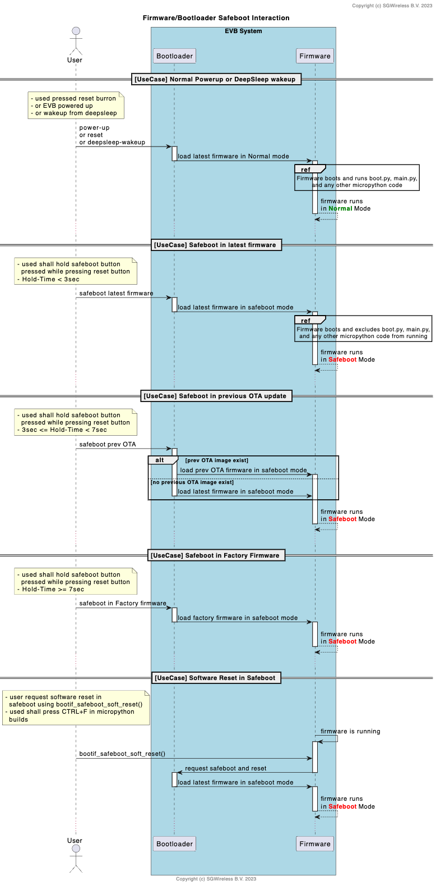
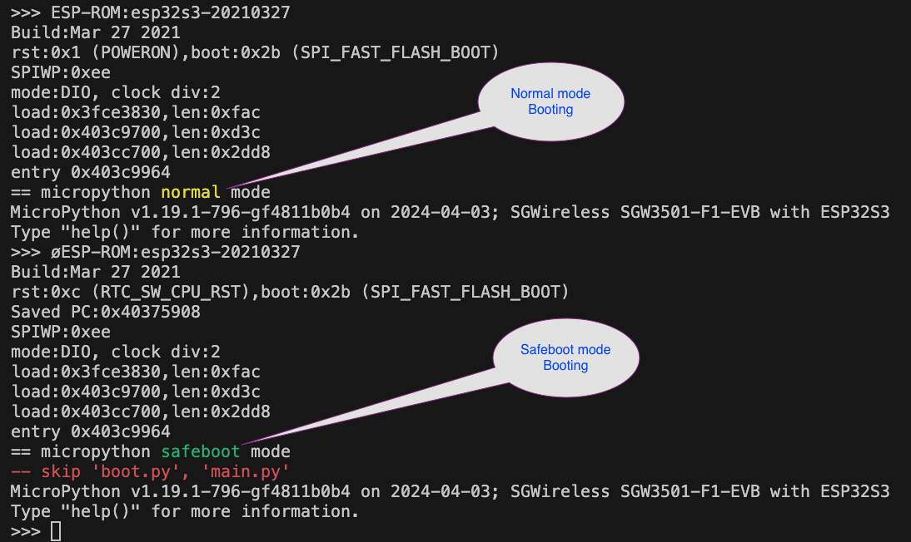
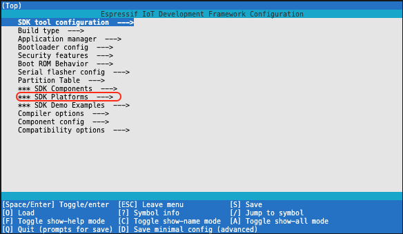
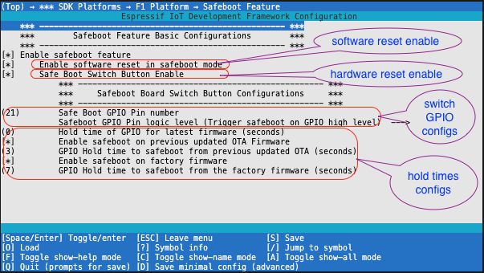

<!------------------------------------------------------------------------------
 ! @copyright Copyright (c) 2023-2024 SG Wireless - All Rights Reserved
 !
 ! Permission is hereby granted, free of charge, to any person obtaining a copy
 ! of this software and associated documentation files(the “Software”), to deal
 ! in the Software without restriction, including without limitation the rights
 ! to use,  copy,  modify,  merge, publish, distribute, sublicense, and/or sell
 ! copies  of  the  Software,  and  to  permit  persons to whom the Software is
 ! furnished to do so, subject to the following conditions:
 !
 ! The above copyright notice and this permission notice shall be included in
 ! all copies or substantial portions of the Software.
 !
 ! THE SOFTWARE IS PROVIDED “AS IS”,  WITHOUT WARRANTY OF ANY KIND,  EXPRESS OR
 ! IMPLIED,  INCLUDING BUT NOT LIMITED TO  THE  WARRANTIES  OF  MERCHANTABILITY
 ! FITNESS FOR A PARTICULAR PURPOSE AND NONINFRINGEMENT.  IN NO EVENT SHALL THE
 ! AUTHORS  OR  COPYRIGHT  HOLDERS  BE  LIABLE FOR ANY CLAIM,  DAMAGES OR OTHER
 ! LIABILITY, WHETHER IN AN ACTION OF CONTRACT, TORT OR OTHERWISE, ARISING FROM,
 ! OUT OF OR IN  CONNECTION WITH  THE SOFTWARE OR  THE USE OR OTHER DEALINGS IN
 ! THE SOFTWARE.
 !
 ! @author  Ahmed Sabry (SG Wireless)
 !
 ! @brief   Documentation file for the SDK Safeboot Feature.
 !----------------------------------------------------------------------------->

# SafeBoot Feature

<!------------------------------------------------------------------------------
 ! TOC
 !----------------------------------------------------------------------------->

## Contents

* [Introduction](#intro)
* [Entering Safeboot](#enter-safeboot)
* [Safeboot Configurations](#safeboot-configs)
* [Safeboot APIs](#safeboot-api)

<!------------------------------------------------------------------------------
 ! Introduction
 !----------------------------------------------------------------------------->
<div id="intro"></div>

## Introduction

SafeBoot feature introduces two modes of system boot:

* `Normal-mode` in which the system performs the normal start-up booting
  sequence and initialization scripts `boot.py` and `main.py` in case of the
  micropython build variant.

* `Safeboot-mode` in which the system performs only the basic system booting
  sequence such as hardware initialization and skips the normal application
  initialization and intialization scripts in case of micropython build variant.

<!------------------------------------------------------------------------------
 ! Entering Safeboot
 !----------------------------------------------------------------------------->
<div id="enter-safeboot"></div>

## Entering Safeboot

The system normally boots in `Normal-mode`, and the system offers two ways to
trigger the `Safeboot-mode`:

* `software-reset`: the system can be triggered to reset in `safeboot-mode` by
  a software call to this function `bootif_safeboot_soft_reset()`.
  In `micropython` variant, there is a shortcut key `Ctrl + F` which triggers
  the same function call.

* `Hardware-Safeboot-Button`: the system also, offers another way using an
  external switch push button connected to one of the microcontroller boot
  strapping GPIOs. The system will detect if this button is pressed during reset
  and enters the `Safeboot-mode`.

  The boards which are have this button mounted on it, will activate this 
  feature by default, but for the OEM modules which does not have any shield,
  it is disabled by default.
  
  For OEM modules, the customer will eventually integrate it on a special PCB
  for his own application project. In case the new project design needs to
  utilize this feature, then it could be activated from the SDK `menu-config`
  options and can be configggered to use another GPIO pin than the default one.

  In this triggerring mode, the system offers as well, some extra options
  depending on the switch press holding time. There are three different holding
  times:
    * `Safeboot in Latest Firmware Hold Time` (default 0 <= T < 3 sec):<br>
       The system boots from the latest updated firmware image.
    * `Safeboot in previous OTA Firmware Hold Time` (default 3 <= T < 7 sec):
       <br>
       The system boots from the previous OTA image if exist. Otherwise, boots
       from the latest.
    * `Safeboot in Factory Firmware Hold Time` (default 7 <= T sec):<br>
       The system boots from the factory firmware in safeboot mode.

  All of those times are configurables.

The following sequence chart, shows the interaction between the bootloader and
the running application in the context of the Safeboot actions;



The following picture, shows the system `Normal-boot` after system reset,
followed by another system reset in `Safeboot-mode` by pressing `Ctrl + F`.




<!------------------------------------------------------------------------------
 ! Safeboot Configurations
 !----------------------------------------------------------------------------->
<div id="safeboot-configs"></div>

## Safeboot Configurations

First trigger the build-system command `config` to enter the `menu-config`
screen, for example: ```./fw_builder.sh --board SGW3501-F1-EVB config```, then
the build system will open a screen like this:



Then select `*** SDK Platform` and in the next screen, select `F1 Platform`,
then `Safeboot Feature`, then you get this screen:



* [Safeboot APIs](#safeboot-api)

<!------------------------------------------------------------------------------
 ! Safeboot APIs
 !----------------------------------------------------------------------------->
<div id="safeboot-api"></div>

## Safeboot APIs

The main interface of the safeboot functionalities are in
`<SDK-ROOT>/src/platforms/F1/bootloader_components/boot-if/boot_if.h`
which declare the following APIs:

* `bootif_state_set()` this function sets the current boot state of the system
  it is used as a ping-pong value between the bootloader and the
  firmware in the following way:
  
  If it set by the firmware, the boot loader will start the safeboot mode
  automatically.
 
  If it is set by the firmare, it means the safeboot button is pressed
  and according to the hold-time the intended image will be loaded.
 
  the responsibility to reset the state to normal, is for the firmware
  after reading it, every time for both triggering modes whether
  by software reset of by the hardware safeboot button.

* `bootif_state_set()` this function gets the current boot state of the system,
  it is usually called from the application to know whether the system boots
  in normal or safeboot to take the proper action.

* `bootif_safeboot_soft_reset()` this function hard resets the system in
  safeboot state. 
  it is called from the application side to make a software safeboot.

* `bootif_safeboot_soft_reset_init()` init the software reset mechanism. it must
  be called in the system startup initialization sequence, so that the rest of
  safeboot API is accessible.

<!--- end of file ------------------------------------------------------------->
