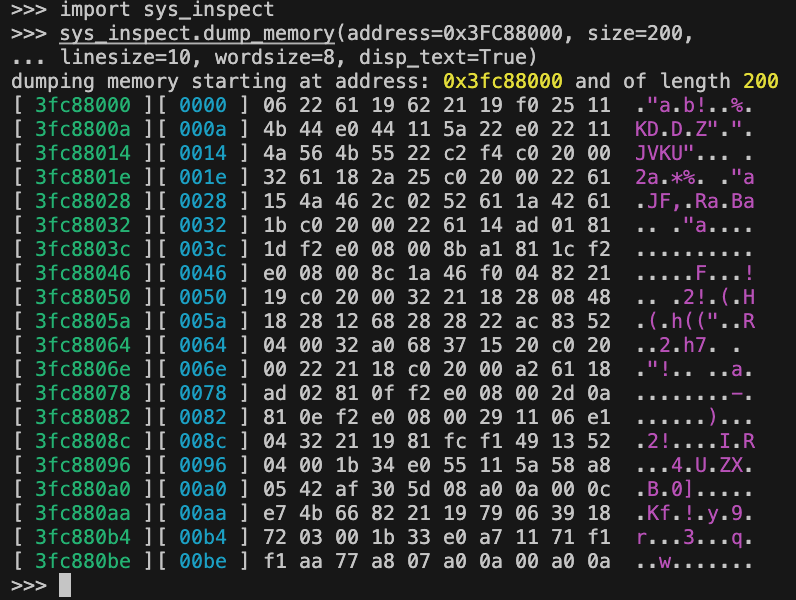
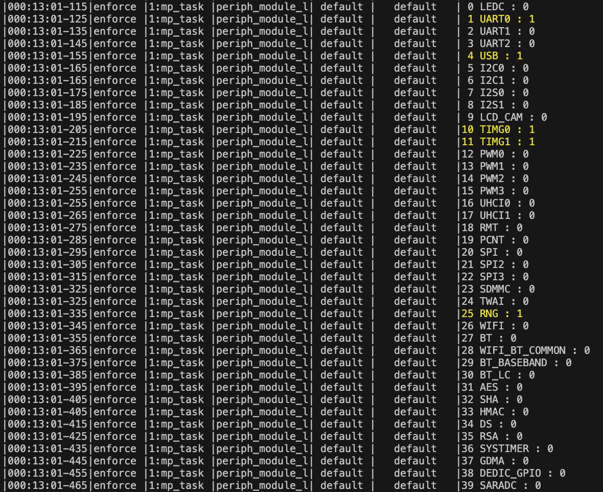

<!------------------------------------------------------------------------------
 ! @copyright Copyright (c) 2023-2024 SG Wireless - All Rights Reserved
 !
 ! Permission is hereby granted, free of charge, to any person obtaining a copy
 ! of this software and associated documentation files(the “Software”), to deal
 ! in the Software without restriction, including without limitation the rights
 ! to use,  copy,  modify,  merge, publish, distribute, sublicense, and/or sell
 ! copies  of  the  Software,  and  to  permit  persons to whom the Software is
 ! furnished to do so, subject to the following conditions:
 !
 ! The above copyright notice and this permission notice shall be included in
 ! all copies or substantial portions of the Software.
 !
 ! THE SOFTWARE IS PROVIDED “AS IS”,  WITHOUT WARRANTY OF ANY KIND,  EXPRESS OR
 ! IMPLIED,  INCLUDING BUT NOT LIMITED TO  THE  WARRANTIES  OF  MERCHANTABILITY
 ! FITNESS FOR A PARTICULAR PURPOSE AND NONINFRINGEMENT.  IN NO EVENT SHALL THE
 ! AUTHORS  OR  COPYRIGHT  HOLDERS  BE  LIABLE FOR ANY CLAIM,  DAMAGES OR OTHER
 ! LIABILITY, WHETHER IN AN ACTION OF CONTRACT, TORT OR OTHERWISE, ARISING FROM,
 ! OUT OF OR IN  CONNECTION WITH  THE SOFTWARE OR  THE USE OR OTHER DEALINGS IN
 ! THE SOFTWARE.
 !
 ! @author  Ahmed Sabry (SG Wireless)
 !
 ! @brief   Documentation file for System Inspection Services.
 !----------------------------------------------------------------------------->

# System Inspection

<!------------------------------------------------------------------------------
 ! TOC
 !----------------------------------------------------------------------------->

## Contents

* [Introduction](#intro)
* [Memory Dump](#mem-dump)
* [Peripherals Power](#periph-power)

<!------------------------------------------------------------------------------
 ! Introduction
 !----------------------------------------------------------------------------->

## Introduction

This component introduces some miscellaneous functions to help in system
inspection and debugging.

<!------------------------------------------------------------------------------
 ! Memory Dump
 !----------------------------------------------------------------------------->

## Memory Dump `sys_inspect.dump_memory()`

It is a utility function to dump a certain memory space.

It takes the following keyword argument:
* `address`     the start address of the dump memory space
* `size`        size of data to dumpped
* `wordsize`    display word size of dumped data (32, 16, or 8)
* `linesize`    number of display bytes per line
* `disp_text`   show the printable ascii character of the data.

Example: the following picture shows an example of the memory dump

<!------------------------------------------------------------------------------
 ! Peripherals Power
 !----------------------------------------------------------------------------->

## Peripherals Power

It is a set of utilities that help in inspection of the enabled system
peripherals. That could help in power management inspection.
The current available methods are:

* `sys_inspect.periph_module_list()` It lists the whole list of system
  peripherals and indicate the peripheral along with how many other system
  actors are using it. The periphiral in use indicate that its power is on.

* `sys_inspect.periph_power(<periph>, True|False)` It tries to disabled the
  module compulsory, in this case, the system may perform in undesired behaviour

The following is a screen shot to the `periph_module_list()`

<!--- end of file ------------------------------------------------------------->
