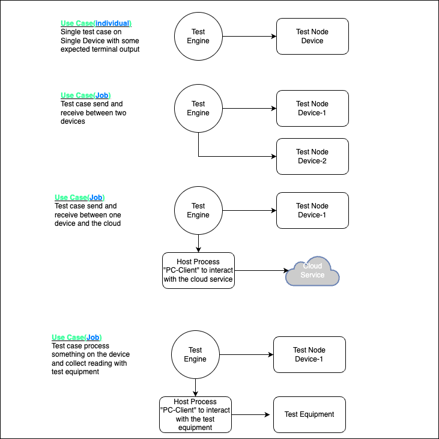
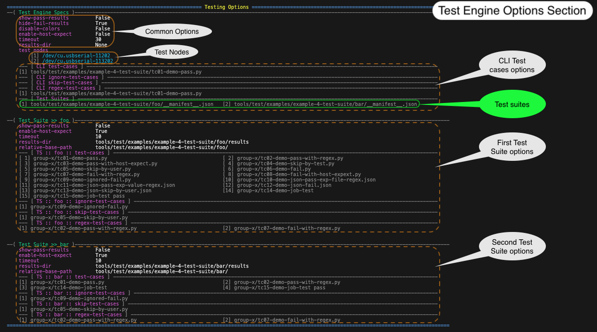
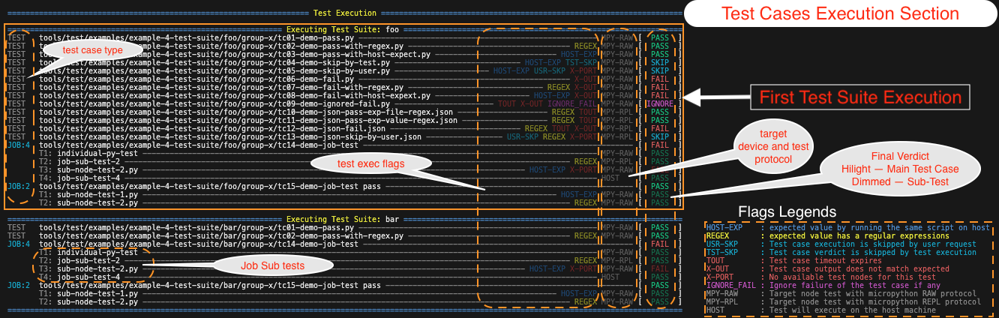
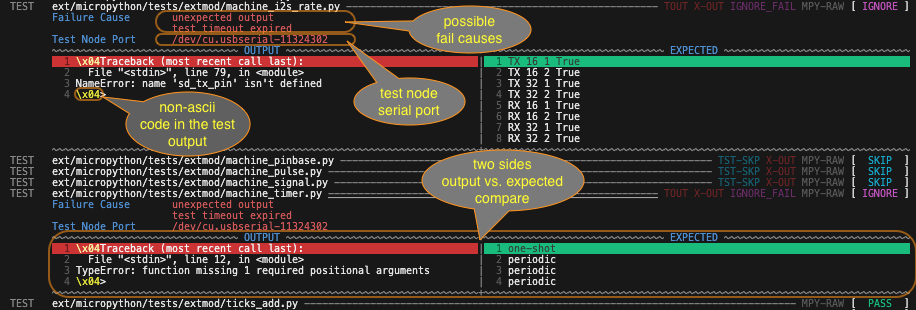
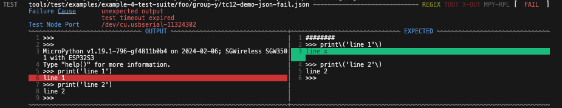
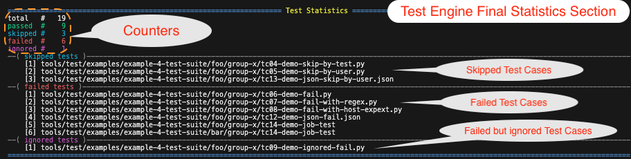

<!------------------------------------------------------------------------------
 ! @copyright Copyright (c) 2023-2024 SG Wireless - All Rights Reserved
 !
 ! Permission is hereby granted, free of charge, to any person obtaining a copy
 ! of this software and associated documentation files(the “Software”), to deal
 ! in the Software without restriction, including without limitation the rights
 ! to use,  copy,  modify,  merge, publish, distribute, sublicense, and/or sell
 ! copies  of  the  Software,  and  to  permit  persons to whom the Software is
 ! furnished to do so, subject to the following conditions:
 !
 ! The above copyright notice and this permission notice shall be included in
 ! all copies or substantial portions of the Software.
 !
 ! THE SOFTWARE IS PROVIDED “AS IS”,  WITHOUT WARRANTY OF ANY KIND,  EXPRESS OR
 ! IMPLIED,  INCLUDING BUT NOT LIMITED TO  THE  WARRANTIES  OF  MERCHANTABILITY
 ! FITNESS FOR A PARTICULAR PURPOSE AND NONINFRINGEMENT.  IN NO EVENT SHALL THE
 ! AUTHORS  OR  COPYRIGHT  HOLDERS  BE  LIABLE FOR ANY CLAIM,  DAMAGES OR OTHER
 ! LIABILITY, WHETHER IN AN ACTION OF CONTRACT, TORT OR OTHERWISE, ARISING FROM,
 ! OUT OF OR IN  CONNECTION WITH  THE SOFTWARE OR  THE USE OR OTHER DEALINGS IN
 ! THE SOFTWARE.
 !
 ! @author  Ahmed Sabry (SG Wireless)
 !
 ! @brief   A comprehensive documentation of the test engine
 !----------------------------------------------------------------------------->

<!------------------------------------------------------------------------------
 ! Header and TOC
 !----------------------------------------------------------------------------->
# Test Engine

## Contents

* [Introduction](#intro)
* [Test Case Type](#types)
* [Test Protocols](#protos)
* [Test Expected Output](#exps)
* [Test Engine Options](#opts)
* [Test Suite Specs](#test-suite)
* [Test Case Specs](#test-case)
* [Test Engine Output Report](#report)
* [Examples](#examples)
    * [Example: single test case -- micropython-repl-raw proto](#example-1)
    * [Example: single test case -- micropython-repl-friendly proto](#example-2)
    * [Example: job test case](#example-3)
    * [Example: test suite](#example-4)


<!------------------------------------------------------------------------------
 ! Introduction
 !----------------------------------------------------------------------------->
<div id="intro"></div>

## Introduction

The Test Engine can derive a complete test suite execution and validation.
It provides different test types such as `individual` or `job` tests.
It validates the test results against a provided expected test output.
It uses different protocols to execute the tests based on the specified
or deduced protocol for each test. There are a lot of available options to give
the tester more flexbility in developing the test cases. It could detect the
connected devices automatically or take them through its robust command line
interface.

The following diagram shows some use cases for the test engine:<br>


<!------------------------------------------------------------------------------
 ! Types of test cases
 !----------------------------------------------------------------------------->
<div id="types"></div>

## Test Case Type

It supports two kinds of test cases; individual test case and job test case.

* <u>**An `individual` test case**</u><br>
    It is simply a test case that will run on an single device whether it is a
    target hardware node or the host machine in a separate process.
    The host machine is the same machine that runs the Test Engine.

* <u>**A `job` test case**</u><br>
    It is a group of an `individual` tests that will run on parallel and all
    of those test are considered part of the test case, so that the job test is
    a representation of a single test case that needs multiple parties to be
    executed together to fulfill the intended test or use case.

    * EX -- sending and receiving from two different nodes.
    * EX -- sending from a node device and receiving from the internet


<!------------------------------------------------------------------------------
 ! Testing protocols
 !----------------------------------------------------------------------------->
<div id="protos"></div>

## Test Protocols

It supports different testing protocols and can be extended for new defined
protocols. The current supported protocols are:

* **`Micropython REPL-RAW protocol`**:
    * Using this protocol the engine will communicate with the underlying device
      by sending a complete python script and fetch its output.
    * The test is concluded by receiving the end of output marker or a timeout
      expires.
    * Example of the test that could be executed using this protocol is simply
      a normal micropython script such as:
      ```python
      # in the test case file path/to/test_case_file.py
      print('line 1')
      print('line 2')
      ```
    * This tests that uses this protocol should be written in a `.py` file.

* **`Micropython REPL-Friendly protocol`**: 
    * Using this protocol, the engine will take a sequence of the desired
      commands to be issued to the device one by one.
    * The test is concluded by only a specified timeout.
    * Extra short-cut commands are supported. Those short cuts are:
      ```'CTRL-A', 'CTRL-B', ... ```
    * Example of this test is simply a provided array in JSON file like this:
      ```json
      // in the test case file path/to/test_case_file.json
      "commands" : [
          "CTRL-C",
          "CTRL-B",
          "print('line 1')",
          "print('line 2')"
      ]
      ```

* **`Host protocol`**:
    * Using this protocol, the user specifies a command to be executed on the
      host machine in a separate process. The host machine is the same machine
      that run and executes this Test Engine.
    * Examples:
      > **Example**: a normal shell command

      > **Example**: a special script through its dedicated interpreter to do a
      > special thing like waiting for something from the internet (EX: using 
      > gRPC API) or communicating smartly with any other smart equipement to
      > check the equipement readings against the node device.


<!------------------------------------------------------------------------------
 ! Expected output processing
 !----------------------------------------------------------------------------->
<div id="exps"></div>

## Test Expected Output

We will be referring to the test expected output using this term `exp-val`.

The engine supports `exp-val` to be able to compare the real test output versus
an expected output.
This `exp-val` can be either of those:

* A dedicated expectation file containing the `exp-val`. This `exp-val` can be
    * a plain text
    * or regular expressions lines to be flexible for values that depends for
      example on present time or some stored keys which are unique for each
      device. This concept is inherited from the original micropython tester.
      <br>
      There are some rules in writing this kind of expected output.
        * Each line by its own is considered a regular expression and shall
          follow the known regular expression syntax.
        * If the complete line is eight hashes `########`, then it tells the
          test engine, that this line could match any number of lines until
          the next line is hit.
        * If the line starts with eight hashes followed by a regular expression,
          then it tells the test engine to match zero or more lines that match
          that specified regular expression until the next line gets hit.
          ```
          1 ########
          2 This line matches a date \d\d\d\d:\d\d:\d\d
          3 A key: 0x[0-9a-fA-f]+
          4 ########counting down \d+
          5 some text
          ```
          the previous line numbers are not parts of the lines, here are the
          explaination:
          1.  matches any number of lines until a line matches line 2 regex gets
              hit.
          2.  matches a single line with a specific regex
              `This line matches a date \d\d\d\d:\d\d:\d\d`
          3.  matches a single line with a specific regex
              `A key: 0x[0-9a-fA-f]+`
          4.  matches zero or more lines that match this regex
              `counting down \d+` until line 5 regex gets hit
          5. matches a single line with a specific regex `some text`

* In case of using `Micropython REPL-RAW protocol`, the user can expoit the host
  python interpreter to predict `exp-val`. For tests that has this option
  enabled, the engine will run the same test script on the host machine and its
  output will be used as an `exp-val`. This concept is inherited from the
  original micropython tester.


<!------------------------------------------------------------------------------
 ! Test Engine options
 !----------------------------------------------------------------------------->
<div id="opts"></div>

# Test Engine Options

The test engine options are designed for running specified tests or a complete
test suite. The options are as follows:

* **Test nodes serial port options**:
    * `--ports` It takes one or more serial COM port to be used as a test node
        devices. If not specified, the test engine will scan all of the attached
        devices to the host machine according to its internal criteria and will
        use them as a test nodes.<br>
        If nothing specified or the scan process return nothing, the test engine
        aborts.

* **Test cases options**:

    * `--test-cases` It takes one or more files which implements the intended
      test cases.
        * Any given `.py` or `.json` file will be considered an `individual`
          test case.
        * Any given directory will be considered a `job` test case.

    * `--test-dirs` It takes one or more directory containing the intended
      test cases. All files and first level sub-directories at those given
      directories will be collected and filtered as follows:
        * All `.py` and `.json` file will be fetched and considered as an
          `individual` test cases.
        * All first level sub-directories will be fetched and considered a `job`
          test cases if it matches the `job` test case rules.

    * `--regex-test-cases` It contains a list of test cases whose given
      `exp-val` is a regular expressions lines.

    * `--regex-test-cases-lists` It contains a list of files. Each of those
      files contains a list of test cases whose given `exp-val` is a regular
      expressions lines.

    * `--ignore-test-cases` It contains a list of test cases which will be
      ignored if they failed and does not affect the final return code of the
      test engine.

    * `--ignore-test-cases-lists` It contains a list of files. Each of those
      files contains a list of test cases which will be ignored if  they failed
      and does not affect the final return code of the test engine.

    * `--skip-test-cases` It contains a list of test cases. The test engine will
      skip their execution.

    * `--skip-test-cases-lists` It contains a list of files. Each of those files
      contains a list of test cases. All of those test cases will be skipped by
      the test engine from running.
    
    * `--test-suites` It contains a list of files. Each of those files is a
      complete specification for a test suite that contain its own test options
      and test cases collection.

* **Control options**.<br>
    * `--disable-colors` It disables output terminal coloring.

* **Global default execution options**.<br>

  These global Test Engine options are applied to all provided test cases and
  test suites. For each test suite, it has its own scope of options, it can
  either override any of the global scope options or inherit the global option.

    * `--timeout` To specify the deadline time execution for each test case.

    * `--show-pass-results` To open verbosity of printing the passed test cases
      output. It is closed by default.

    * `--hide-fail-results` To close verbosity of printing the failed test cases
      output. It is opened by default.

    * `--enable-host-expect` To enable collecting `exp-val` from the host
      python interpreter for those test cases that are a python scripts and does
      not have a specified expected value file `.exp` or value.

    * `--results-dir` It is a directory at which the test engine will store
      all failed test cases results and `exp-val`.


<!------------------------------------------------------------------------------
 ! Test Suite Specs
 !----------------------------------------------------------------------------->
<div id="test-suite"></div>

# Test Suite Specs

The test suite file is a JSON formatted file that specifies the references to
its test cases along with their scope options.

The typical formatting for the test suite is in the following JSON example:
```json
// ===[ Test Suite Specs File ]=================================================
{
    // a name for the test suite
    "name" : "",

    // ====[ Test Suite Scope Options]==========================================
    // § It overrides the test engine default options that are given in the
    //   command line. Those options are only applicable for the test cases of
    //   this test suite.
    // § Each test case can override one or more of these options if it is
    //   specified using a json file
    // =========================================================================
    
    // -- to instruct the test engine to print out the passed test cases outputs
    "show-pass-results"  : false,
    "hide-fail-results"  : false,

    // -- to instruct the test engine to fetch the micropython test cases expect
    //    values from the host python interpreter unless the test case has its
    //    corresponding expect file
    "enable-host-expect" : true,

    // -- default timeout for the test cases of this test suite
    "timeout" : 30,

    // -- default directory at which the test engine will dump the output and
    //    expected value for each test case in in this test suite
    "results-dir" : "path/to/failed-results-dir",

    // ====[ Test Cases References ]============================================
    // § The same command line test case referencing options are used here
    // § The references here are applicable only within this test suite
    // § CLI references of 'regex', 'ignore' and 'skip' lists are also
    //   considered for all test suites
    // =========================================================================

    // -- All files references in this test suite JSON will be relative to this
    //    path. If this attribute is absent, the files will be relative to the
    //    path where the test-engine command is invoked.
    "relative-path" : "relative/path",

    // -- array containing a specific test cases
    "test-cases" : [ "path/to/tc-1.py", "path/to/tc-2.json" ],
    // -- array containing a specific test dirs, the will be fetched like its
    //    corresponding CLI option
    "test-dirs"  : [ "path/to/dir-a", "path/to/dir-b" ],

    // -- array containing a specific test cases whose expect value has a regex
    "regex-test-cases" : [ "path/to/tc-1.py" ],
    // -- array containing a some files whose lines are test cases of regex exp
    "regex-test-cases-lists" : [ "path/to/regex-tests-list.txt" ],

    // -- array containing a specific test cases to be ignored if failed
    "ignore-test-cases" : [ "path/to/tc-2.json" ],
    // -- array containing a some files whose lines are test cases to be ignored
    "ignore-test-cases-lists" : [ "path/to/ignore-tests-list.txt" ],

    // -- array containing a specific test cases to be skipped from running
    "skip-test-cases" : [ "path/to/tc-2.json" ],
    // -- array containing a some files whose lines are test cases to be skipped
    "skip-test-cases-lists" : [ "path/to/skip-tests-list.txt" ]
}
```

<!------------------------------------------------------------------------------
 ! Test Case Specs
 !----------------------------------------------------------------------------->
<div id="test-case"></div>

# Test Case Specs

The test case can be a JSON file with details specification of the test case or
it could be a simple python script to be executed on the target node.

There are two types of test cases:

* <u>**individual test case:**</u>
    To specify an individual test case, it depends on its used testing protocol:
    * `.json file` to specify a test case whose protocol is
      `Micropython REPL-Friendly protocol` or a `Host protocol`.
      It should have the following formatting:
        ```json
        {
            // -- array of commands sequence or command with its args sequence
            "tst-proc" : [
                "CTRL-C",
                "print('line 1')",
                "print('line 2')"
            ],

            // ---[ expected value look up method ]-----------------------------
            // § The test engine will take the expected value in the following
            //   priority order
            //      1. if "exp-file" option is specified in this file, and exist
            //         in the file system, it will opted and taken
            //      2. if "exp-value" option is specified in this file and not
            //         empty, it will be opted and taken
            //      3. if there exist a file with the same name as the test case
            //         file appended with '.exp' extension, it will be taken
            //      4. no exp value is specified for this test case.
            // -----------------------------------------------------------------
            "exp-file" : "relative/path/to/specific-exp-file.exp",
            // when specifying "exp-value", because of JSON formatting
            // limitations, each individual expected line will be a string
            // literal in an array of expected lines.
            "exp-value" : [
                "---> line 1",
                "---> line 2"
            ],

            "timeout" : 20,     // optional special timeout for the test
            "regex"   : true,   // its exp value is a regex

            // -- the following attributes are good during development phase
            //    to not affect the running regression test report results
            "skip"    : false,  // optional attribute to skip executing it
            "ignore"  : false,  // optional attribute to ignore this tc failure
            "show-pass":false,  // enforce pass output dumping
            "hide-fail":false   // suppress fail output dumping
        }
        ```
      The optional expected output file shall be of the same test case file name
      with appended `.exp` extension. For example:
      ```shell
      test-case-dir/
        |-- test-case-file.json
        `-- test-case-file.json.exp   # this will be fetched by the test engine
      ```

    * `.py file` to specify a test case that always working with
      `Micropython REPL-RAW protocol` only. It is a pure micropython code.

      The test case might have an optional expected output file.

      The optional expected output file shall be of the same test case file name
      with appended `.exp` extension. For example:
      ```shell
      test-case-dir/
        |-- test-case-file.py
        `-- test-case-file.py.exp   # this will be fetched by the test engine
      ```

* <u>**job test case:**</u>
    The job test case follow the following rules:
    * Each job test case shall be in a separate directory.
    * The directory name itself will be the test case name.
    * The directory shall contain a default test case config file with the name
      `__job__.json`.
    * All individual test cases attached to this job shall be referenced in the
      `__job__.json` file by a relative path to the job test case directory.
    * The formatting of the `__job__.json` shall be as follows:
        ```json
        {
            // =================================================================
            // individual tests
            // =================================================================
            "job-tests" : [
                // =============================================================
                // a typical configuration for a job individual test
                // =============================================================
                {
                    // --[ target and testing protocol identification ]---------
                    // the target is deduced from the used testing protocol
                    "protocol" :
                        "micropython-repl-raw",         // node device
                        //"micropython-repl-friendly",  // node device
                        //"host-process",               // host machine

                    // --[ name determination ]---------------------------------
                    // the test individual name is determined in the following
                    // priority order.
                    //  (1) if the attribute "name" specified here, it will be
                    //      considered as the test individual name
                    //  (2) if the protocol used is "micropython-repl-raw",
                    //      and there exist only one python-script specified
                    //      in the attribute "tst-proc" of this test individual,
                    //      it will be opted and taken as a name
                    //  (3) if (1) and (2) steps are not valid, the test engine
                    //      will qualify a name with this synopsis for this
                    //      individual test:
                    //          "job-<node|host>-sub-test-<n>",
                    //              where <n> is the order of appearing of this
                    //              individual test in this file
                    "name" : "sub-test-specific-name",

                    // --[ test procedure ]-------------------------------------
                    "tst-proc" : [
                        // micropython-repl-raw --> sequence of python scripts
                        //      They will be concatenated together and
                        //      considered as a single test script
                        "script-x.py", "script-y.py", // ...

                        // micropython-repl-friendly --> sequence of commands
                        //      they will be issued to the target test device
                        //      one by one
                        "node-dev-cmd-1", "node-dev-cmd-2", // ...

                        // host protocol --> sequence of host command followed
                        //      by its arguments. The command will be
                        //      concatenated with its argument and executed on
                        //      separate host process.
                        "host-client-process-cmd", "arg-1", "arg-2" // ...
                    ],

                    // --[ expected output ]------------------------------------
                    // The expected value is deduced based on the following
                    // priority order
                    //  (1) if "exp-file" attribute is specified here, and
                    //      exist in the file system, it will opted and taken
                    //  (2) if "exp-value" option is specified in this file
                    //      and not empty, it will be opted and taken
                    //  (3) if there exist a file with the same name as the
                    //      deduced individual test name with '.exp' extension
                    //      then it will be taken.
                    //      this file existence is checked at the relative
                    //      path to the job directory.
                    //  (4) if the test protocol is "micropython-repl-raw"
                    //      and this test individual is deduced to have the flag
                    //      "exp-host" enabled, then the test engine will deduce
                    //      the expected value by running the same python script
                    //      on the host machine.
                    //  (5) otherwise, no exp value is considered for this test
                    //      individual
                    "exp-file" : "relative/path/to/test-case.exp",
                    "exp-value" : [
                        "exp-value: line 1",
                        "exp-value: line 2"
                    ],
                    // The expected value by host python interpreter is done
                    // if and only if the flag "exp-host" is enabled for this
                    // particular test. This flag is enabled in the following 
                    // order.
                    //  (1) if "exp-host" attribute is specified in this test
                    //      individual, the flag is anabled or disabled based on
                    //      its value. If the attribute is absend, go to step(2)
                    //  (2) If the attribute "enable-host-expect" is specified
                    //      in the test suite JSON config, then its value will
                    //      be considered. If the attribute is absent there,
                    //      then go to step(3)
                    //  (3) If the test engine command line option
                    //      "--enable-host-expect" is provided, then the flag
                    //      is enabled for this test individual. If CLI option
                    //      is absent, then go to step(4)
                    //  (4) Disable the flag.
                    "exp-host"  : true,

                    // --[ extra particular test options ]----------------------
                    "show-pass" : false,// enable/disable pass results dumping
                    "hide-fail" : false,// enable/disable fail results dumping
                    "timeout" : 20,     // special timeout
                    "regex"   : true,   // consider the exp value has regex
                    "skip"    : false,  // to skip executing this individual tc
                    "ignore"  : false   // to ignore failure of this tc
                },
                {
                    // -- the 2nd test individual configs
                },
                {
                    // -- the 3rd test individual configs
                }

                // ...
            ]
        }
        ```
    * The typical directory structure for the job test case is like this:
        ```shell
        job-test-case-dir/
            |-- __job__.json                    # mandatory file
            |-- node-test-individual-X.py       # test script for node-tc X
            |-- node-test-individual-X.py.exp   # expected output for node-tc X
            |-- node-test-individual-Y.py       # test script for tc node-Y
            |-- node-test-individual-Y.py.exp   # expected output for node-tc Y
            |-- node-test-individual-Z.exp      # expected output for node-tc Z
            |-- host-test-individual-A.exp      # expected output for host-tc A
            `-- host-test-individual-B.exp      # expected output for host-tc B
        ```


<!------------------------------------------------------------------------------
 ! Test Engine output reports
 !----------------------------------------------------------------------------->
<div id="report"></div>

# Test Engine Output Report

* The test engine output a very descriptive report about every test case.

* The test engine report is split into the following sections:

    * <u>**Test Engine Options Section**</u><br>
        It shows the collected specifications from the CLI and config files.
        It shows the target test nodes serial ports that are going to be used
        for target tests.
        This section output looks like the following image.<br>
        

    * <u>**Test Cases Execution Section**</u><br>
        It shows the execution of the test case with its enabled flags and its
        final verdict. It also shows the failure cause for the failed tests.
        It also display side by side comparison between the test real output
        and its expected value if the test failed.
        This section output looks like the following image.<br>
        

        * <u>**Failed Test Cases**</u><br>
            The test engine will print the cause of the test case failure.
            If the test case failed due to un-expected output, the test engine
            will print side by side the output versus the expected lines as in
            this image.<br>
            <br>
            <br>
            <br>

    * <u>**Test Statistics Section**</u><br>
        It shows the total considered tests, number of (passed, failed, ignored,
        and skipped) test cases.
        This section output looks like the following image.<br>
        


* The test engine process itself return code is the number of failed test cases
    to be used by other systems such as "Jenkins" to determine the test phase
    success or failure.


<!------------------------------------------------------------------------------
 ! Examples
 !----------------------------------------------------------------------------->
<div id="examples"></div>

# Examples

<div id="example-1"></div>

### <u>Example: single test case -- micropython-repl-raw proto</u>

<div id="example-2"></div>

### <u>Example: single test case -- micropython-repl-friendly proto</u>

<div id="example-3"></div>

### <u>Example: job test case</u>

<div id="example-4"></div>

### <u>Example: test suite</u>


<!--- end of file ------------------------------------------------------------->
